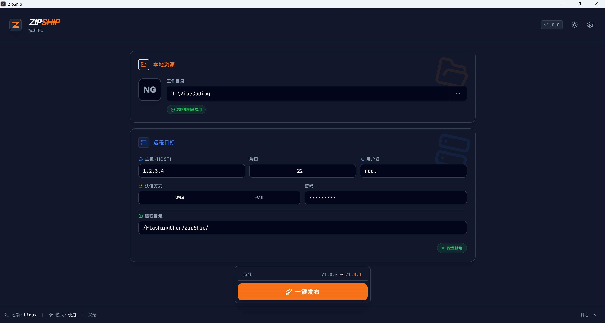
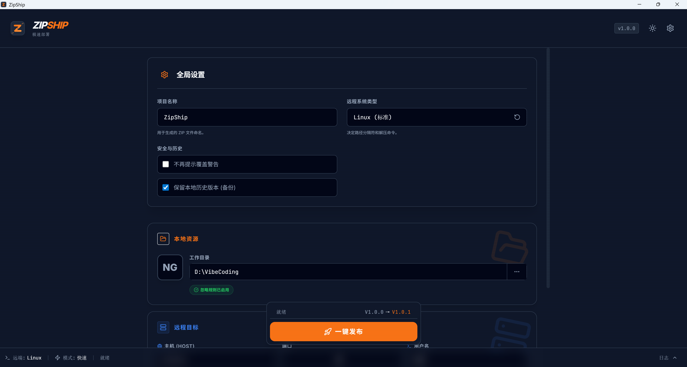
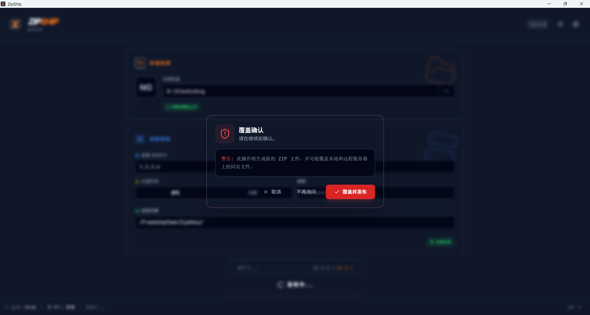
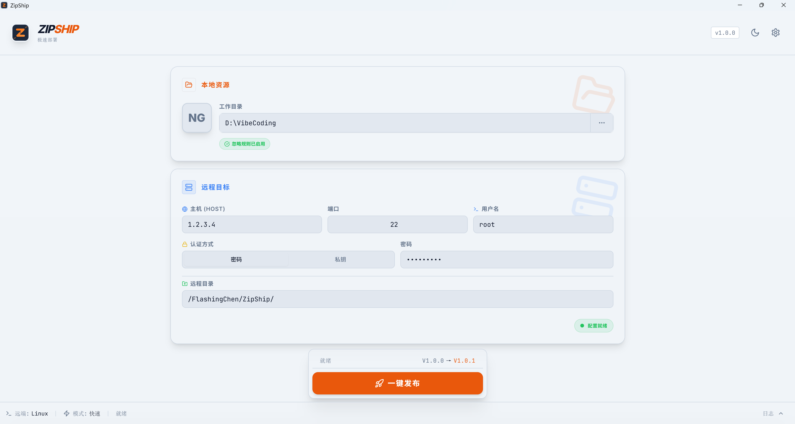
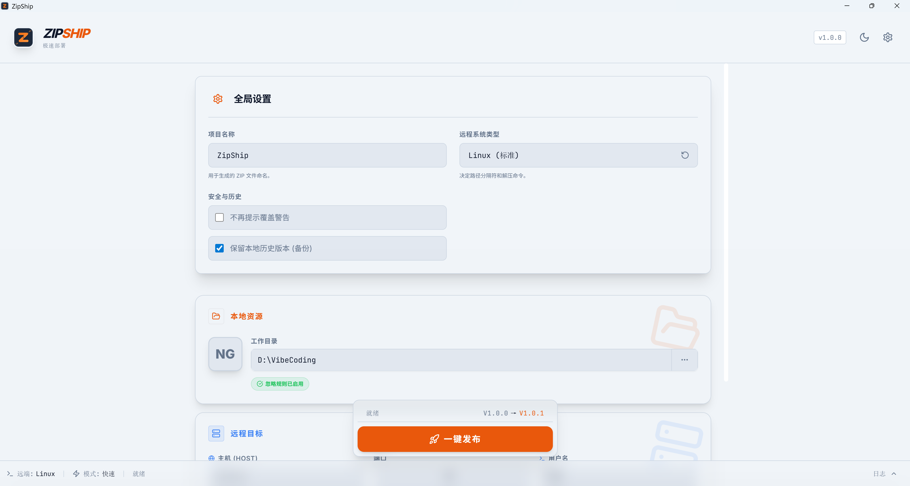
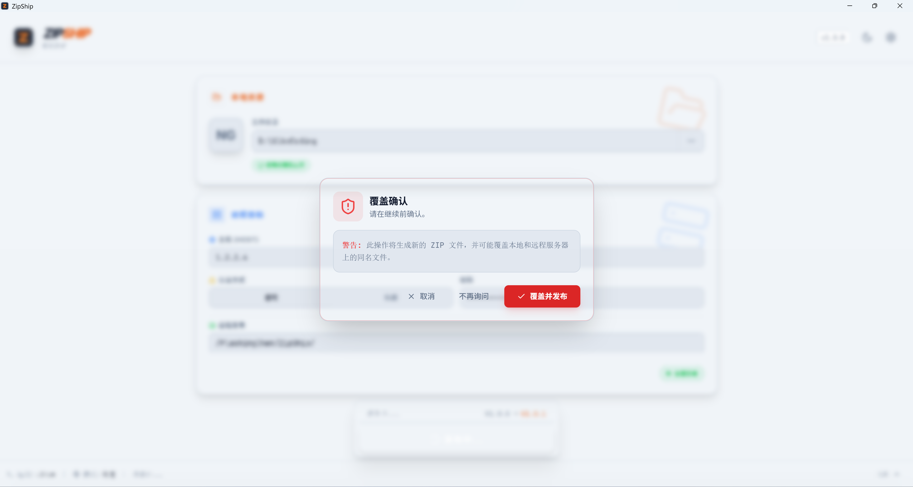

# ZipShip 🚀

<p align="center">
  <strong>跨平台一键部署桌面工具</strong><br>
  将本地工作目录打包为 ZIP → SFTP 上传 → SSH 解压覆盖，一气呵成
</p>

<p align="center">
  <a href="#功能特点">
    
  </a>
  <a href="#使用说明">
    
  </a>
  <a href="#技术栈">
    
  </a>
  <a href="#快速开始">
    
  </a>
</p>

---

## 📌 项目简介

ZipShip 是一款**跨平台桌面部署工具**，专为需要频繁将本地代码同步到远程服务器的开发者/运维人员设计。

只需**选目录 → 点发布**，即可完成：
1. 📦 **本地打包** - 按 `.zipshipignore` 规则生成 ZIP
2. 📤 **SFTP 上传** - 支持断点续传
3. 📂 **SSH 解压** - 自动覆盖远程文件

> 无需手动敲命令，GUI 一点搞定"压缩 + 上传 + 解压"全流程。

---

## 🖼️ 界面预览

### 🌙 深色模式

| 主界面 | 设置面板 |
|--------|----------|
|  |  |

| 部署确认 | 日志面板 |
|----------|----------|
|  | - |

### ☀️ 浅色模式

| 主界面 | 设置面板 |
|--------|----------|
|  |  |

| 部署确认 |
|----------|
|  |

---

## ✨ 功能特点

### 核心功能

| 功能 | 说明 |
|------|------|
| 🔒 **多种认证方式** | 支持密码认证和私钥认证（可选口令） |
| 🖐️ **主机指纹验证** | 首次连接提示确认，类似系统 SSH 体验 |
| 📊 **版本号管理** | 自动递增（v1.0.0 → v1.0.1），支持手动调整 |
| 🚫 **智能忽略** | 支持 `.zipshipignore`，语法兼容 `.gitignore` |
| ⚠️ **覆盖保护** | 每次压缩前弹窗提醒，可设置"不再提醒" |
| 📶 **断点续传** | SFTP 支持续传被中断的大文件 |
| 📜 **操作日志** | 完整记录每次操作，支持日志落盘 |
| 🎨 **双主题** | 支持浅色/深色模式，响应系统主题 |

### 技术亮点

- **跨平台**：Windows / macOS / Linux 原生支持
- **安全**：凭证可存系统钥匙串，绝不记录明文密码
- **高效**：Rust 后端，性能卓越
- **现代**：React 19 + Tailwind CSS + Framer Motion

---

## 🛠️ 技术栈

| 层级 | 技术 |
|------|------|
| 框架 | [Tauri 2.x](https://tauri.app/) |
| 后端 | Rust |
| 前端 | React 19 + TypeScript |
| 样式 | Tailwind CSS |
| 动画 | Framer Motion |
| SSH/SFTP | [ssh2](https://github.com/alexcrichton/ssh2-rs) |
| ZIP | [zip crate](https://github.com/zip-rs/zip) |

---

## 📖 使用说明

### 1. 初始化配置

首次使用需要配置：

```
1. 选择本地工作目录
2. 填写远程服务器信息（主机、端口、用户名）
3. 选择认证方式（密码/私钥）
4. 选择目标服务器系统类型（Linux/Windows）
5. 填写远程上传目录
6. 设置初始版本号（如 v1.0.0）
```

### 2. 一键发布

```
点击「发布」按钮 → 自动完成：打包 → 上传 → 解压
```

### 3. 分步操作（可选）

如需单独执行某个阶段：
- 📦 **压缩** - 仅生成本地 ZIP
- ⬆️ **上传** - 仅上传 ZIP 到服务器
- 📂 **解压** - 仅执行远程解压

---

## 🚀 快速开始

### 前置要求

- [Node.js 20+](https://nodejs.org/)
- [Rust 1.70+](https://rustup.rs/)
- [pnpm](https://pnpm.io/)（推荐）或 npm/yarn

### 安装依赖

```bash
# 安装前端依赖
pnpm install

# 检查 Tauri 环境
pnpm tauri info
```

### 开发模式

```bash
# 启动前端 + Tauri 开发服务器
pnpm tauri dev
```

### 构建发布

```bash
# 构建生产版本
pnpm tauri build
```

构建产物位于：
- Windows: `src-tauri/target/release/bundle/nsis/*.exe`
- macOS: `src-tauri/target/release/bundle/app/*.app`
- Linux: `src-tauri/target/release/bundle/appimage/*.AppImage`

---

## 📁 项目结构

```
CodeFerry/
├── src/                      # React 前端源码
│   ├── components/           # UI 组件
│   │   ├── Header.tsx        # 顶部导航
│   │   ├── Footer.tsx        # 底部状态栏
│   │   ├── LocalSection.tsx  # 本地配置区
│   │   ├── RemoteSection.tsx # 远程配置区
│   │   ├── SettingsPanel.tsx # 设置面板
│   │   ├── DeployButton.tsx  # 发布按钮
│   │   ├── LogsPanel.tsx     # 日志面板
│   │   └── ...
│   ├── App.tsx               # 主应用组件
│   ├── zipship-api.ts        # Tauri API 调用封装
│   └── main.tsx              # 入口文件
├── src-tauri/                # Tauri/Rust 后端
│   ├── src/
│   │   └── main.rs           # Rust 主入口
│   ├── Cargo.toml            # Rust 依赖
│   └── tauri.conf.json       # Tauri 配置
├── crates/
│   └── zipship-core/         # 核心业务逻辑库
│       ├── src/
│       │   ├── lib.rs        # 库入口
│       │   ├── package.rs    # ZIP 打包
│       │   ├── sftp.rs       # SFTP 上传
│       │   ├── ssh.rs        # SSH 执行
│       │   └── config.rs     # 配置管理
│       └── Cargo.toml
├── screen/                   # 界面截图
├── package.json              # Node 依赖
├── Cargo.toml                # Rust workspace
└── README.md                 # 本文件
```

---

## 🔧 配置说明

### `.zipshipignore` 语法

与 `.gitignore` 兼容：

```gitignore
# 忽略 node_modules
node_modules/

# 忽略所有 .log 文件
*.log

# 忽略 .zipship 目录（自动忽略，无需配置）
!.gitkeep

# 只忽略 build，但保留 dist/build
/build/
!dist/build
```

### 配置文件

配置存储在应用数据目录：

| 平台 | 路径 |
|------|------|
| Windows | `%APPDATA%\com.zipship.app\` |
| macOS | `~/Library/Application Support/com.zipship.app/` |
| Linux | `~/.config/com.zipship.app/` |

---

## 🤝 贡献指南

欢迎提交 Issue 和 Pull Request！

1. Fork 本仓库
2. 创建特性分支 (`git checkout -b feature/xxx`)
3. 提交更改 (`git commit -m 'Add xxx'`)
4. 推送分支 (`git push origin feature/xxx`)
5. 打开 Pull Request

---

## 📄 开源协议

MIT License - 详见 [LICENSE](./LICENSE) 文件。

---

## 🙏 致谢

- [Tauri](https://tauri.app/) - 构建跨平台应用
- [ssh2-rs](https://github.com/alexcrichton/ssh2-rs) - Rust SSH/SFTP
- [zip-rs](https://github.com/zip-rs/zip) - Rust ZIP 处理
- [React](https://react.dev/) - UI 框架
- [Tailwind CSS](https://tailwindcss.com/) - 样式框架

---

<p align="center">
  <sub>Built with ❤️ using Tauri + Rust</sub>
</p>
